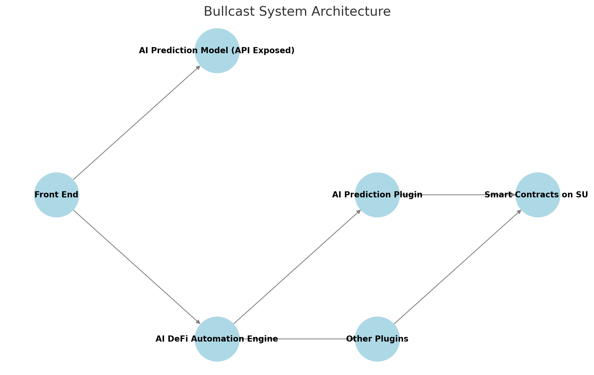

# 👋 Welcome to Bullcast


**GitBook tip:** your product docs aren't just a reference of all your features! use them to encourage folks to perform certain actions and discover the value in your product.


## Overview

Bullcast is an **AI-powered DeFi assistant** that helps users **automate** and **optimize** their trading and investment strategies. By leveraging **AI-driven price predictions**, Bullcast enables seamless interactions with DeFi protocols through a chat-based interface.

With Bullcast, users can **forecast price** movements, automate token swaps, provide liquidity, and engage in yield farming. The AI model processes real-time market data, offering actionable insights and automation capabilities on the $SUI blockchain. Developers can also integrate Bullcast’s API to access its prediction engine and DeFi automation tools.

### Features

* ✅ **Token Transfers**
* ✅ **Swaps**
* ✅ **Auto-Investment**
* ✅ **API for Prediction**
* ✅ **Feeds Price Data from Pyth Network Oracle**
* 🚀 **Providing Liquidity (Proof of Concept)**
* 🚀 **Yield Farming (Proof of Concept)**
* 🚀 **Auto-Investment with Pyth Network (Proof of Concept)**
* ✅ **Price Action Predictions**
* 🚀 **Prediction Challenges & Incentive Mechanism**: Users can participate in daily, weekly, and monthly prediction challenges. If their price predictions are more accurate than the AI model, they earn tokens as rewards. This creates an incentive-based "**Predict-to-Earn**" mechanism.

### Blockchain Support

* **Primary Focus**: $SUI Blockchain
  * Chosen for its efficiency and suitability for AI-driven DeFi applications.
* Will integrate EVM chains as Base, Ethereum.

### Architecture

<figure><figcaption></figcaption></figure>
